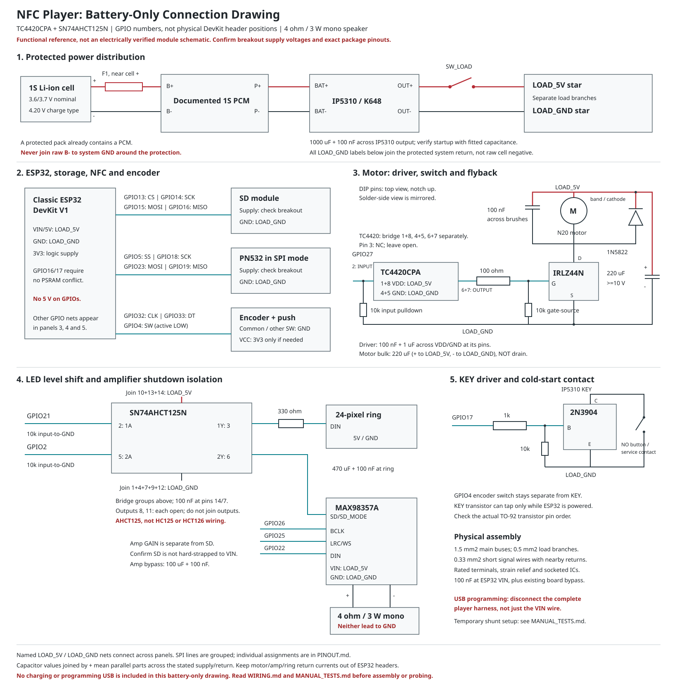

# Pinout and Connection Overview

This is the single GPIO connection table for the current battery-only build.
GPIO numbers are ESP32 signal names, NOT physical header positions; clone-board
layouts vary. Classic ESP32/WROOM without PSRAM remains the working assumption,
not a verified module identity. GPIO16/17 must be available, not used by PSRAM.

The symbol, GPIO and component columns are checked against
[firmware/nfc_player/pins.h](firmware/nfc_player/pins.h) and
[hardware.json](hardware.json). Update all three when deliberately changing the
pin map. Connection notes and the diagram are not an electrically checked netlist.
Component IDs correspond to [BOM.csv](BOM.csv).

<!-- PINOUT:BEGIN -->
| Symbol | GPIO | Component | Connection and conditions |
|---|---|---|---|
| AMP_ENABLE | 2 | U_BUFFER | SN74AHCT125N 2A, pin 5, with 10k to GND; 2Y, pin 6, goes to amplifier SD/SD_MODE. Never connect GPIO2 directly to amplifier SD. Boot-strap review required. |
| ENCODER_SW | 4 | ENC1 | Encoder push switch to GND; active LOW. Wakes a powered sleeping ESP32, not a shut-down IP5310. |
| PN532_SS | 5 | U_NFC | PN532 SS/SSEL; set the module to SPI. Verify reset-state module pulls on this boot-strap pin. |
| SD_CS | 13 | U_SD | SD module CS. |
| SD_SCK | 14 | U_SD | SD module SCK/CLK. |
| SD_MOSI | 15 | U_SD | SD module MOSI/DI. Verify reset-state pulls on this boot-strap pin. |
| SD_MISO | 16 | U_SD | SD module MISO/DO; GPIO16 must not be occupied by PSRAM. |
| IP5310_KEY | 17 | Q_KEY | 1k to 2N3904 base; 10k base-to-emitter; emitter to system GND; collector to IP5310 KEY. Never connect KEY directly to a GPIO. |
| PN532_SCK | 18 | U_NFC | PN532 SCK. |
| PN532_MISO | 19 | U_NFC | PN532 MISO. |
| LED_DATA | 21 | U_BUFFER | SN74AHCT125N 1A, pin 2, with 10k to GND; 1Y, pin 3, through 330 ohm to ring DIN. |
| I2S_DOUT | 22 | U_AMP | MAX98357A DIN. |
| PN532_MOSI | 23 | U_NFC | PN532 MOSI. |
| I2S_LRC | 25 | U_AMP | MAX98357A LRC/WS. |
| I2S_BCLK | 26 | U_AMP | MAX98357A BCLK. |
| MOTOR_GATE | 27 | U_GATE | TC4420CPA INPUT pin 2 with 10k to GND; joined OUTPUT pins 6/7 through one 100 ohm resistor to IRLZ44N gate. Keep 10k directly between gate and source. GPIO27 does not drive the MOSFET gate directly. |
| ENCODER_CLK | 32 | ENC1 | Encoder A/CLK; common to GND. |
| ENCODER_DT | 33 | ENC1 | Encoder B/DT; common to GND. |
<!-- PINOUT:END -->

All ESP32-side logic is **3.3 V, not 5 V tolerant**. GPIO12 and flash GPIO6-11 are
forbidden in this design. The retained straps 2, 5 and 15 are reviewed in
[DESIGN_DECISIONS.md](DESIGN_DECISIONS.md#boot-pin-review).

## Small connection schematic

Open the full-page [SCHEMATIC.svg](SCHEMATIC.svg) for the complete module-level
view, including power protection, the original driver/buffer, capacitors, KEY
and the confirmed 4 ohm / 3 W mono speaker. Named supply nets join across panels.
It is a drawing aid, not proof of clone-board internals or an ERC-checked netlist.



```text
1S cell + fuse + protection --> IP5310/K648
  IP5310 OUT+ -- SW_LOAD --> LOAD_5V
  IP5310 OUT- -----------> LOAD_GND (protected system return)

LOAD_5V --+--> ESP32 VIN/5V
          +--> amplifier VIN, ring 5V, AHCT125 VCC, TC4420 VDD
          +--> motor +
motor - ------> IRLZ44N drain; source --> LOAD_GND
flyback diode: anode --> motor -; band/cathode --> motor +

GPIO27 --> TC4420 pin 2; joined pins 6/7 --> 100 ohm --> IRLZ44N gate
GPIO21 --> AHCT125 channel 1 --> 330 ohm --> ring DIN
GPIO2  --> AHCT125 channel 2 -------------> amplifier SD
GPIO17 --> 1k --> KEY transistor base; collector --> IP5310 KEY
GPIO4  --> encoder push switch --> LOAD_GND
IP5310 KEY --> separate NO contact/service connector --> LOAD_GND

LOAD_GND --> module grounds, buffer/driver grounds, KEY emitter
ESP32 3V3 --> encoder breakout VCC, only if it needs power
```

- SD and PN532 supply voltages depend on the actual breakout schematic; they are
  deliberately absent from the blanket 5 V list. Their SPI signals must be 3.3 V
  compatible. Do not drive any unpowered module through its GPIO connections.
- SN74AHCT125N DIP-14: join pins 1, 4, 7, 9, 12 to LOAD_GND; join pins 10, 13, 14
  to LOAD_5V. Outputs 8 and 11 each stay open. Never join separate outputs 3, 6,
  8 or 11 together. Inputs 2 and 5 keep separate 10k pulldowns, not direct ground
  bridges. Add 100 nF between pins 14/7. Use AHCT, not plain HC.
- TC4420CPA DIP-8: join VDD pins 1/8 to LOAD_5V; join GND pins 4/5 to LOAD_GND;
  join OUTPUT pins 6/7 before the single 100 ohm gate resistor. INPUT is pin 2;
  pin 3 is NC and stays open. All three duplicate pairs must be connected
  externally. Add 100 nF plus 1 uF local bypass across the VDD/GND groups. Gate,
  driver-input and buffer-input pulldowns remain required; this text overview
  omits their drawn symbols.
- Amplifier SD must not be hard-strapped to VIN. GAIN is separate; both speaker
  wires go to amplifier outputs, neither to ground. See the breakout checks in
  [WIRING.md](WIRING.md#dip-ahct125-led-and-amplifier).
- The KEY transistor cannot cold-start an unpowered ESP32. Retain an already
  verified 2N7000 implementation instead if fitted; do not build both alternatives.

DIP numbering is top view, notch at the top and pin 1 upper-left; the solder-side
view is mirrored. Use short socket-pad links or a common local rail for each
group, keeping different groups separate. See the complete
[pin-bridge tables](WIRING.md#tc4420cpa-dip-8-pin-bridges) before soldering.

The diagram is an overview, not a replacement for protection terminals, capacitor
placement and reset-state checks in [WIRING.md](WIRING.md). All load returns must
remain on the protected side of the battery circuit.

## Manufacturer reference diagrams

These are the closest useful block references, not a verified schematic of the
complete K648/DevKit/breakout combination. Use this project's GPIO assignments;
other boards' example GPIO numbers and power wiring are not interchangeable.

- [Microchip TC4420/29 datasheet, page 1](https://ww1.microchip.com/downloads/aemDocuments/documents/APID/ProductDocuments/DataSheets/21419D.pdf#page=1):
  TC4420 non-inverting DIP-8 pin diagram and the requirement to connect both pins
  of every duplicate supply/GND/output pair; pin 3 is NC.
- [TI SN74AHCT125 datasheet, page 3](https://www.ti.com/lit/ds/symlink/sn74ahct125.pdf#page=3):
  DIP-14 pin diagram; later sections cover active-LOW enables, bypass/layout and
  TTL input levels.
- [Adafruit MAX98357A mono schematic](https://cdn-learn.adafruit.com/assets/assets/000/032/642/medium800/adafruit_products_schem.png?1464034817):
  close reference for the seven-pin I2S amplifier. Compare SD/GAIN resistors and
  supply capacitors with the actual breakout; do not assume a clone matches it.
  [Downloads and board files](https://learn.adafruit.com/adafruit-max98357-i2s-class-d-mono-amp/downloads).
- [Adafruit NeoPixel wiring practices](https://learn.adafruit.com/adafruit-neopixel-uberguide/best-practices):
  data resistor, local capacitance, common ground and 3.3 V to 5 V level shifting.

The exact K648 power path, DevKit USB/VIN routing and SD/PN532 supply circuitry
still require their board schematics or inspection. They are not inferred from
the silicon names. The dedicated shunt connection diagram and scope settings are
in [MANUAL_TESTS.md](MANUAL_TESTS.md#inrush-current-with-a-shunt-and-oscilloscope).

## USB programming boundary

No tag is NOT power isolation. For the current programming procedure, disconnect
the complete player harness, including GPIOs, from ESP32 and use its USB alone.
Remove USB before reconnecting battery wiring. A powered ESP32 can back-feed
unpowered peripherals even with the motor stopped. Simultaneous charging and
fully wired dual-USB operation have separate gates in
[MANUAL_TESTS.md](MANUAL_TESTS.md#later-usb-and-charging-tests).